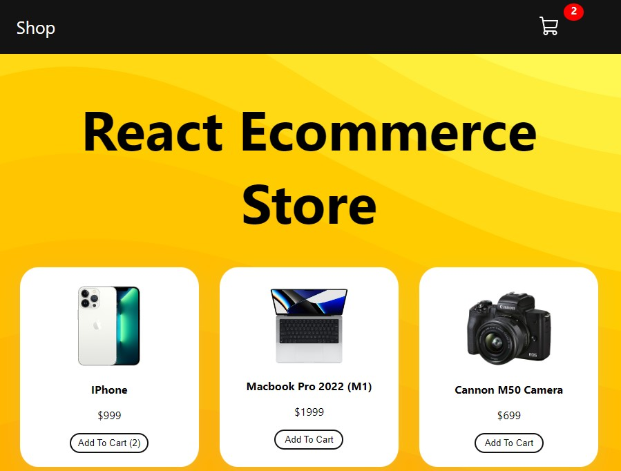
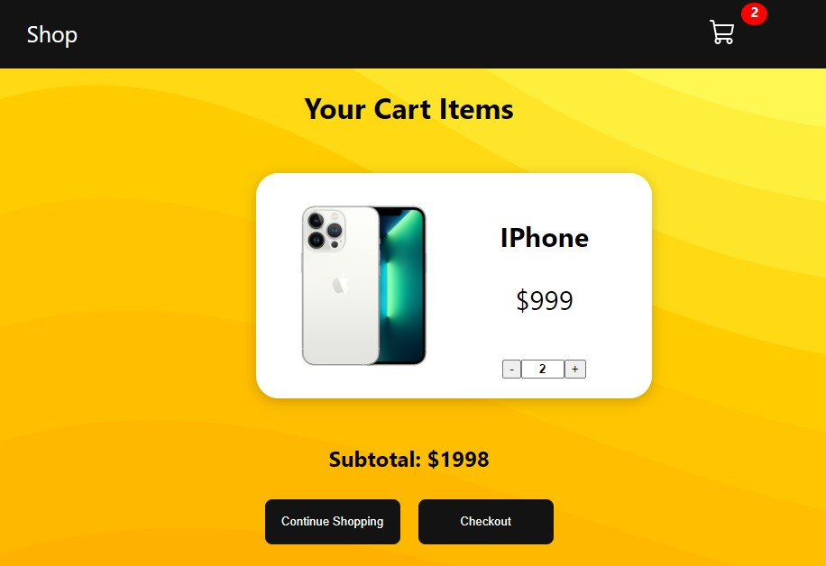

# React E-commerce Store
This is a simple e-commerce application built using React, designed to showcase various features and skills in web development.



***


## Features

- **Product Listing**: Display a list of products fetched from the `PRODUCTS` data source.
- **Add to Cart**: Users can add products to their shopping cart.
- **Remove from Cart**: Products can be removed from the cart.
- **Update Cart Quantity**: Users can update the quantity of products in the cart.
- **View Cart**: Navigate to the cart page to view the selected items.
- **Subtotal Calculation**: Calculate the subtotal of items in the cart.
- **Continue Shopping**: Users can easily return to shopping from the cart.
- **Navigation**: Use React Router for navigation between shop and cart pages.
- **Context API**: Utilize the Context API for state management.
- **Responsive Design**: Implement a responsive design for a better user experience on different devices.

## Project Structure

The project is organized into the following components:

- **Shop**: Displays a list of products in the store.
- **Product**: Represents an individual product with options to add to the cart.
- **CartItem**: Shows products added to the cart with options to update or remove them.
- **Cart**: Displays the items in the cart and provides options for checkout.
- **Navbar**: Navigational links for shopping and viewing the cart.

## Usage

1. Clone the repository:

   ```bash
   git clone <repository_url>
   ```

2. Install dependencies:

   ```bash
   cd react-ecommerce-store
   npm install
   ```

3. Start the development server:

   ```bash
   npm start
   ```

4. Open your web browser and visit [http://localhost:3000](http://localhost:3000) to interact with the application.

Feel free to explore the codebase and customize the project to suit your needs. Happy coding!

## Credits

This project is based on a tutorial by [PedroTech](https://www.youtube.com/watch?v=tEMrD9t85v4&ab_channel=PedroTech)

